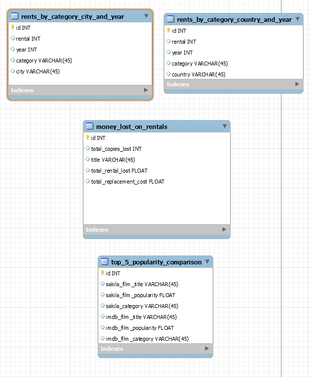

# Sakila ETL Workshop

Welcome!, this is my workshop to get to know how *Extraction*, *Tranformation* and *Load* operations work for business intelligence purposes. In here, we are using the Sakila sample database of MySQL as our data source, you can find more [here](https://dev.mysql.com/doc/sakila/en/).

## Running the data source on Docker

This project has automatized the databases on a Docker instance, you just have to run this command on your local machine:

	docker-compose up -d

Wait for the MySQL instances and databases to finish is initial load and connect to it with any Database Administration Software you want (For example, MySQL Workbench).

To connect to the **source** database, use this values:

	Hostname: localhost or 127.0.0.1
	Port: 33060
	Username: root
	Password: secret

To connect to the **target** database, use this values:

	Hostname: localhost or 127.0.0.1
	Port: 33061
	Username: root
	Password: secret

## How to run the ETL's

The ETL's are written in Python code, to execute it you have to run this command

	docker-compose -f .\docker-compose-etl.yml up

Remember to wait for the database instances to be up first, just give them a minute.
Additionally, wait for the ETL's to finish, this is an even longer process, Docker will close the instance when finished.

## (Sakila) source database definition

Here you can find a diagram of the Sakila database with 16 tables between films, actors, customers, staff, stores and rentals of a DVD rental chain store. 

## ETL operations definitions

1. We want to know which category of movies is the most viewed in each city anually 

2. We want to know which category of movies is the most viewed in each country anually

3. We want to know which film is getting the most unreturned rentals, the total cost of replacement of those copies and how much it was lost on those rentals

4. We want to know the top five most popular movies per category and contrast it with an external movie database

5. ?

## ETL description table

|        | Extraction sources                                                                                                                                                                                                                        | Transformations made on the data                                                                                                                                                                                           | Loaded fields                                                                                                                                                                                                         |
|--------|-------------------------------------------------------------------------------------------------------------------------------------------------------------------------------------------------------------------------------------------|----------------------------------------------------------------------------------------------------------------------------------------------------------------------------------------------------------------------------|-----------------------------------------------------------------------------------------------------------------------------------------------------------------------------------------------------------------------|
| ETL #1 | - Sakila Database tables used : &nbsp;&nbsp;&nbsp;&nbsp;* rental &nbsp;&nbsp;&nbsp;&nbsp;* inventory &nbsp;&nbsp;&nbsp;&nbsp;* film &nbsp;&nbsp;&nbsp;&nbsp;* film_category &nbsp;&nbsp;&nbsp;&nbsp;* category &nbsp;&nbsp;&nbsp;&nbsp;* customer &nbsp;&nbsp;&nbsp;&nbsp;* address &nbsp;&nbsp;&nbsp;&nbsp;* city &nbsp;&nbsp;&nbsp;&nbsp;* country                         | - Calculating count of rentals as total of rentals  - Extraction of maximum of total of rentals                                                                                                                    | - rents_by_category_city_and_year: &nbsp;&nbsp;&nbsp;&nbsp;* rental &nbsp;&nbsp;&nbsp;&nbsp;* year &nbsp;&nbsp;&nbsp;&nbsp;* category &nbsp;&nbsp;&nbsp;&nbsp;* city                                                                                                          |
| ETL #2 | - Sakila Database tables used: &nbsp;&nbsp;&nbsp;&nbsp;* rental &nbsp;&nbsp;&nbsp;&nbsp;* inventory &nbsp;&nbsp;&nbsp;&nbsp;* film &nbsp;&nbsp;&nbsp;&nbsp;* film_category &nbsp;&nbsp;&nbsp;&nbsp;* category &nbsp;&nbsp;&nbsp;&nbsp;* customer &nbsp;&nbsp;&nbsp;&nbsp;* address &nbsp;&nbsp;&nbsp;&nbsp;* country                                          | - Calculating count of rentals as total of rentals  - Extraction of maximum of total of rentals                                                                                                                    |- rents_by_category_country_and_year: &nbsp;&nbsp;&nbsp;&nbsp;* rental &nbsp;&nbsp;&nbsp;&nbsp;* year &nbsp;&nbsp;&nbsp;&nbsp;* category &nbsp;&nbsp;&nbsp;&nbsp;* country                                                                                                    |
| ETL #3 | - Sakila Database tables used: &nbsp;&nbsp;&nbsp;&nbsp;* rental &nbsp;&nbsp;&nbsp;&nbsp;* inventory &nbsp;&nbsp;&nbsp;&nbsp;* film &nbsp;&nbsp;&nbsp;&nbsp;* payment                                                                                                                              | - Calculating count of rentals as total of rentals  - Aggregation of payment per rental to calculate the total rental lost  - Aggregation of cost of replacement per copy to calculate total replacement cost  | - money_lost_on_rentals: &nbsp;&nbsp;&nbsp;&nbsp;* total_copies_lost &nbsp;&nbsp;&nbsp;&nbsp;* title &nbsp;&nbsp;&nbsp;&nbsp;* total_rental_lost &nbsp;&nbsp;&nbsp;&nbsp;* total_replacement_lost                                                                             |
| ETL #4 | - Sakila Database tables used: &nbsp;&nbsp;&nbsp;&nbsp;* film &nbsp;&nbsp;&nbsp;&nbsp;* film_category &nbsp;&nbsp;&nbsp;&nbsp;* category  - IMDb API enpoints used: &nbsp;&nbsp;&nbsp;&nbsp;* /title/get-ratings &nbsp;&nbsp;&nbsp;&nbsp;* /title/get-details &nbsp;&nbsp;&nbsp;&nbsp;* /title/get-popular-movies-by-genre  | - Aggregation of data between Sakila database and IMDb Open API                                                                                                                                                            | - top_5_popularity_comparison &nbsp;&nbsp;&nbsp;&nbsp;* sakila_film_title &nbsp;&nbsp;&nbsp;&nbsp;* sakila_film_popularity &nbsp;&nbsp;&nbsp;&nbsp;* sakila_category &nbsp;&nbsp;&nbsp;&nbsp;* imdb_film_title &nbsp;&nbsp;&nbsp;&nbsp;* imdb_film_popularity &nbsp;&nbsp;&nbsp;&nbsp;* imdb_film_category  |

## Target database definition

Here is the a diagram for the resulting tables on the target database

## How to check the results

Please, as explained earlier, you must connect to the target database using the connection values.
You can run this SQL script to check each one of the tables and its values:

	SELECT * FROM rents_by_category_city_and_year;
	SELECT * FROM rents_by_category_country_and_year;
	SELECT * FROM money_lost_on_rentals;
	SELECT * FROM top_5_popularity_comparison;

# Thank you
