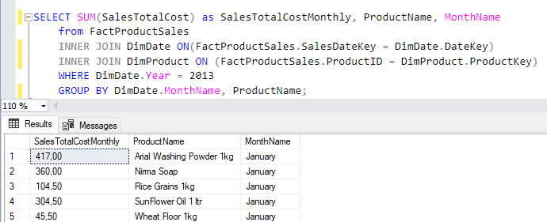
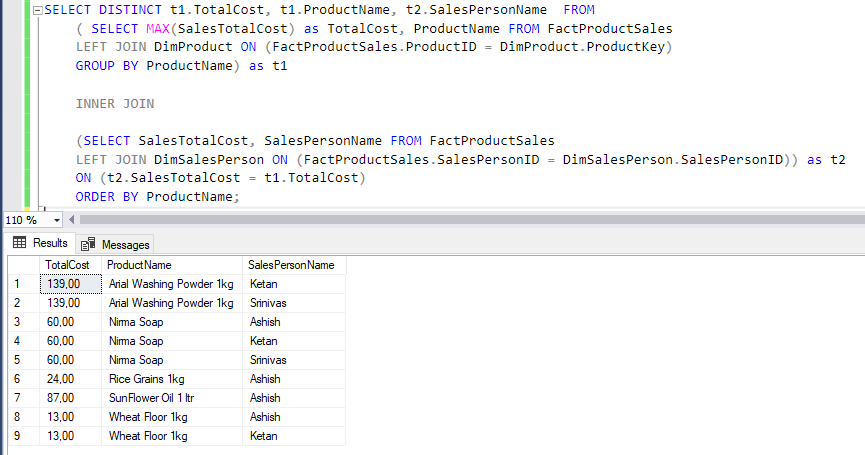
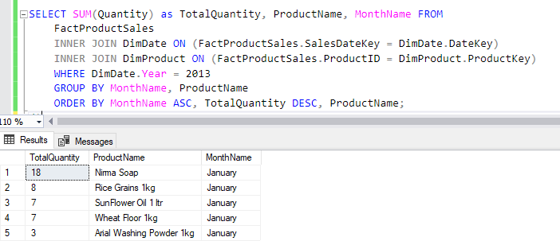
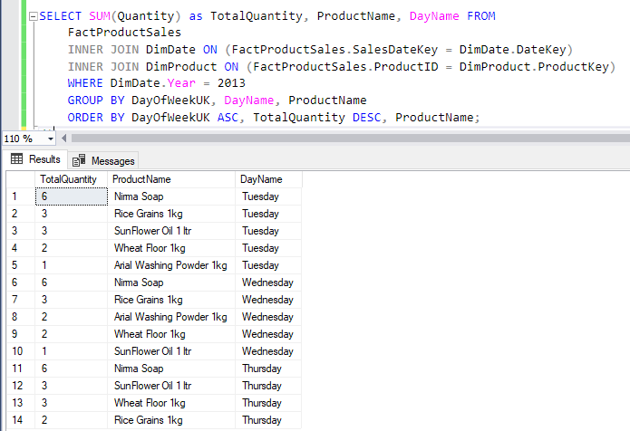
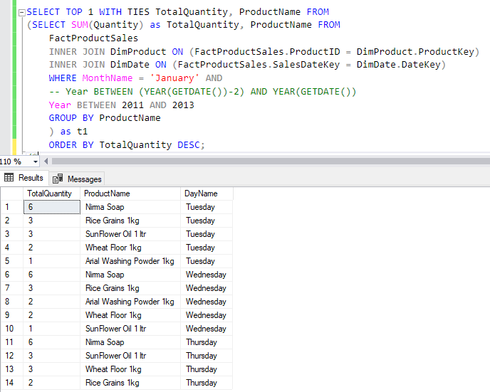
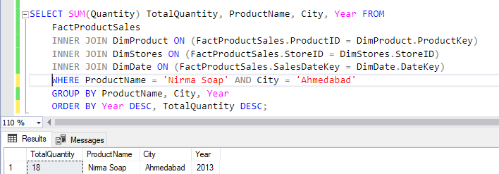
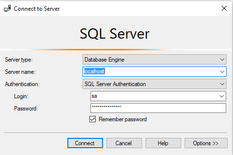

# Workshop #2: Multiple Data Warehouse Challenges

Welcome!, this is a workshop based on the design and creation of data warehouses, take a look on each of the challenges

## Challenge #1

Having the Sakila database and its E/R model, design a data warehouse following the Kimball mehodology or Bottom-up data warehouse approach.

Your tasks are to identify: 
1. Facts table
2. Its granularity 
3. The dimensions related:
	- Hierarchy of those dimensions
	- Junk
	- De-generated
	- Slow changing
4. Metrics. 

Additionally, identify many-to-many relations between facts and dimension tables to provide a solution.

### Solution to challenge # 1

Here is an E/R model of the Sakila database:


### First step - Analizing some tasks that might be useful for Sakila:
I'm going to use the tasks that we defined in the Workshop #1 to help us define our data warehouse

1. We want to know which category of films is the most viewed in each city and country per week, month and year

2. We want to know the top five most popular films per category

3. We want to know which film is getting the most unreturned rentals, the total cost of replacement of those copies and how much it was lost on those rentals

4. We want to know the rentability of each of the stores

5. We want to know which stores are having the most late payments (payments after the return date) per week, month and year

6. We want to know the employee that rents the most per month per store (Employee of the month)

|  | 1 | 2 | 3 | 4 | 5 | 6 |
|-|-|-|-|-|-|-|
| Which is the facts table related on this task? | **Film** | **Film** | **Rental** | **Rental** | **Rental** | **Staff** |
| Which are the dimensions related on this task? | - Film_category<br>- Category<br>- Inventory<br>- Rental<br>- Customer<br>- Address<br>- City<br>- Country | - Film_category<br>- Category | - Inventory<br>- Film<br>- Payment | - Inventory<br>- Store | - Payment<br>- Inventory<br>- Store | - Inventory<br>- Store |
| Which Sakila departments are interested on this task? | - Sales department<br>- Market management department | - Sales department<br>- Market management department | - Portfolio department<br>- Collection Department | - Sales department<br>- Operations department | - Sales department<br>- Operations department | - Sales department<br>- Operations department |

### Second step - Identifyng facts, metrics and dimensions:

| Facts | Film | Rental | Staff |
|-:|-|-|-|
| Useful metrics | 1. Title<br>2. Description<br>3. Release year<br>4. Rental duration<br>5. Rental rate<br>6. Length<br>7. Replacement cost<br>8. Rating<br>9. Special features | 1. Rental date<br>2. Return date<br>3. Time difference between return date and last payment<br>4. Total payments | 1. First name<br>2. Last name<br>3. Email<br>4. Active state |
| Related tables | 1. Category and Film category<br>2. Inventory<br>3. Rental<br>4. Customer<br>5. Address<br>6. City<br>7. Country | 1. Payments<br>2. Inventory<br>3. Store<br>4. Address<br>5. City<br>6. Country | 1. Rental<br>2. Inventory<br>3. Store<br>4. Address<br>5. City<br>6. Country |
| Granularities | 1. For the dates:<br>   - Day<br>   - Week<br>   - Month<br>   - Year<br>2. For films and rentals:<br>   - Each row is a rental of a movie<br>3. Locations are going to be:<br>   - Address<br>   - City<br>   - Country | 1. For payments, there are multiple payments for each rental:<br>   - Date of each payment as Day, Week, Month, Year<br>2. Inventory is going to be part of the films and rentals | - |

### Third step - Designing the dimensions:

This is a first proposal for a model:


1. You can find an hierarchy in Store composed by:
	- country > city > address
2. You can see a big union between film, inventory and rental, on the Film_rental you can find values as:
	- rental_date 
	- return_date
	- staff_id
	- customer_id

### Fourth step - Analysis and modifications:

On this step, we are going to analize some cases where 

## Challenge #2

A web business company records the data of each visit on the web (weblog file). A clickstream is every event that occurs on every web page on the company's servers. The clickstream contains a number of data such as the page, session, the referrer, etc. 

Your task is to identify the necessary transformation tasks, and model a data warehouse to generate statistics to connect this information to the web sales. It is recommend reviewing weblog files and [Google Analytics](https://analytics.google.com/analytics/web/provision/#/provision) and other [visualization tools](https://www.weblogexpert.com/sample/index.htm) to see the impact that the analysis of web information would have.

## Challenge #3

Go to [The Code Project](https://www.codeproject.com/Articles/652108/Create-First-Data-WareHouse) where you can find an example on how to create a data warehouse:

Before we start the challenge, all the needed files as the SQL script file for the database creation and the SQL script to run the resulting queries, even a format to run a Docker instance with SQL Server installed is provided on the folder **/Challenge3** of this workshop.

Your tasks are:
1. Follow the tutorial and create the data warehouse on any DBMS you want (Recommended: MySQL or PosgreSQL)
2. Run this queries:
	1. Total sales of each of the products per month during 2013:
	
	Resulting query

	```sql
	SELECT SUM(SalesTotalCost) as SalesTotalCostMonthly, MonthName 
		from FactProductSales 
		LEFT JOIN DimDate ON(FactProductSales.SalesDateKey = DimDate.DateKey) 
		WHERE DimDate.Year = 2013 
		GROUP BY DimDate.Year, DimDate.Month, DimDate.MonthName;
	```

	And some results:

	

	2. The best seller for each of the products during 2013:

	Resulting query

	```sql
	SELECT DISTINCT t1.TotalCost, t1.ProductName, t2.SalesPersonName  FROM 
		( SELECT MAX(SalesTotalCost) as TotalCost, ProductName FROM FactProductSales
			LEFT JOIN DimProduct ON (FactProductSales.ProductID = DimProduct.ProductKey)
			GROUP BY ProductName) as t1 

		INNER JOIN

		( SELECT SalesTotalCost, SalesPersonName FROM FactProductSales 
			LEFT JOIN DimSalesPerson ON (FactProductSales.SalesPersonID = DimSalesPerson.SalesPersonID)) as t2
		
		ON (t2.SalesTotalCost = t1.TotalCost)
		ORDER BY ProductName;
	```

	And some results:

	

	3. Quantity of each product sold per month during 2013, in order of highest to lowest:

	Resulting query

	```sql
	SELECT SUM(Quantity) as TotalQuantity, ProductName, MonthName FROM 
		FactProductSales
		INNER JOIN DimDate ON (FactProductSales.SalesDateKey = DimDate.DateKey)
		INNER JOIN DimProduct ON (FactProductSales.ProductID = DimProduct.ProductKey)
		WHERE DimDate.Year = 2013
		GROUP BY MonthName, ProductName
		ORDER BY MonthName ASC, TotalQuantity DESC, ProductName;
	```

	And some results:

	

	4. Quantity of each product sold per day (name of days) during 2013, in order of highest to lowest:

	Resulting query

	```sql
	SELECT SUM(Quantity) as TotalQuantity, ProductName, DayName FROM 
		FactProductSales
		INNER JOIN DimDate ON (FactProductSales.SalesDateKey = DimDate.DateKey)
		INNER JOIN DimProduct ON (FactProductSales.ProductID = DimProduct.ProductKey)
		WHERE DimDate.Year = 2013
		GROUP BY DayOfWeekUK, DayName, ProductName
		ORDER BY DayOfWeekUK ASC, TotalQuantity DESC, ProductName;
	```

	And some results:

	

	5. The most sold product in April of the last three years:

	Resulting query

	```sql
	SELECT TOP 1 WITH TIES TotalQuantity, ProductName FROM
		(SELECT SUM(Quantity) as TotalQuantity, ProductName FROM 
			FactProductSales
			INNER JOIN DimProduct ON (FactProductSales.ProductID = DimProduct.ProductKey)
			INNER JOIN DimDate ON (FactProductSales.SalesDateKey = DimDate.DateKey)
			WHERE MonthName = 'January' AND
			Year BETWEEN (YEAR(GETDATE())-2) AND YEAR(GETDATE())
			GROUP BY ProductName 
		) as t1 
		ORDER BY TotalQuantity DESC;
	```

	And some results:

	

	6. Amount of a product sold for years in a specific city. (select the product and the city):

	Resulting query

	```sql
	SELECT SUM(Quantity) TotalQuantity, ProductName, City, Year FROM 
		FactProductSales
		INNER JOIN DimProduct ON (FactProductSales.ProductID = DimProduct.ProductKey)
		INNER JOIN DimStores ON (FactProductSales.StoreID = DimStores.StoreID)
		INNER JOIN DimDate ON (FactProductSales.SalesDateKey = DimDate.DateKey)
		WHERE ProductName = 'Nirma Soap' AND City = 'Ahmedabad'
		GROUP BY ProductName, City, Year
		ORDER BY Year DESC, TotalQuantity DESC;
	```

	And some results:

	

### How to run the Docker instance and the files for Challenge 3

As I mentioned previously, you can run an SQL Server on a Docker instance with the configuration that I already set for you. First, you must set a terminal or CMD on the **Challenge3** folder of this workshop (*/advanceddatabases/Workshop\ #2/Challenge3*) and run this command:

	docker-compose up -d

Once you have the instance running, you can connect with your preferred DBMS Manager (I recommend using SQL Server Management Studio) to the instance running in your Docker. Use this credentials to connect:

}

Remember that the password is: *PasswordO1.* with the ending point. Also, you can change it if you want in the */Challenge3/docker-compose.yml* file.

To run the database scripts, you have to check the files on */Challenge3/config/db/* folder, there are two files:

	challenge-3-schema.sql: This script creates all the tables of the data warehouse
	challenge-3-queries.sql: This another one holds the queries for each of the tasks of this challenge